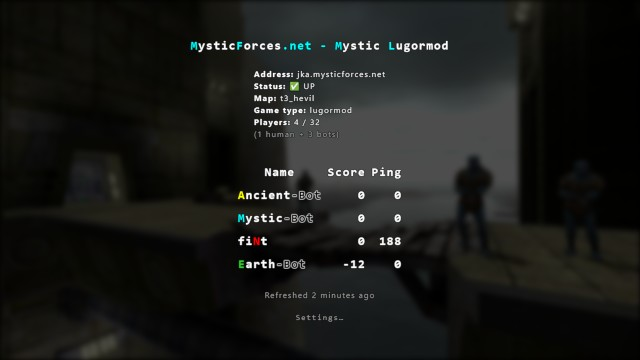
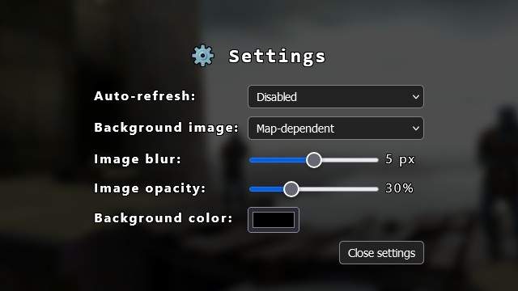

# JKA Server Status - PHP Script
This small PHP tool uses **QStat** to query a **Jedi Academy** server.

[](doc/screenshot.jpg)

## Features
- Retrieves the following information from the server:
    - Server name (with colors)
    - Status
    - Map name
    - Game type
    - Number of players
    - Player list
        - Name (with colors)
        - Score
        - Ping
- Caches `qstat` calls for 10 seconds
- Uses backgrounds from my [**Widescreen levelshots**](https://jkhub.org/files/file/4179-widescreen-levelshots/) pack
    - 1920x1080 resolution, available in JPG + AVIF formats,
    - User-configurable blur and opacity, to improve the readability,
    - Uses `default.jpg` when the map name doesn't match a known levelshot
    - You can add your own backgrounds in the `levelshots` folder, and they should be automatically detected
- Optional auto-refresh (user-configurable)

[](doc/settings.jpg)

## Installation
- Clone (or copy the content of) this repository onto your server,
- Install **QStat**:
    - You can either download the binaries: https://github.com/Unity-Technologies/qstat/releases  
      and put `qstat` (or `qstat.exe`) + `qstat.cfg` in the `bin` folder,
    - Or install it from your distro's package manager (e.g. `sudo apt install qstat` on Debian / Ubuntu)
- Setup your web server to point to the `public` folder,
- In `index.php`:
    - Check the value of the `QSTAT_BINARY` constant,
    - Check the value of the `ROOT_URL` constant,
    - Setup conditions to handle routing (if you want to support multiple JKA servers)
    - Pass the desired `$host` to `print_server_status()`,
- Make sure PHP has write access to the `cache` folder.

## Sample Nginx config
Have a look at [`nginx.sample.conf`](doc/nginx.sample.conf) for an example of:
- Conditional JPEG / AVIF serving
- HTML / CSS / JS compression
- Caching strategy
- Forwarding requests to PHP

Minimum required packages on Debian 12:
```sh
sudo apt install nginx-light
sudo apt install php-fpm
sudo apt install php-xml
```

## License
The code in this repository is released under the [MIT License](LICENSE.txt).

## Credits
- PHP / HTML / CSS / JS / Levelshots by [**Slash**](https://github.com/slash-fr)
- **QStat** is Open Source software (Artistic License 2.0): https://github.com/Unity-Technologies/qstat
- `default.jpg` is based on the following photo (CC0 Public Domain): https://pxhere.com/en/photo/57901  
  → Slightly tweaked by Slash
