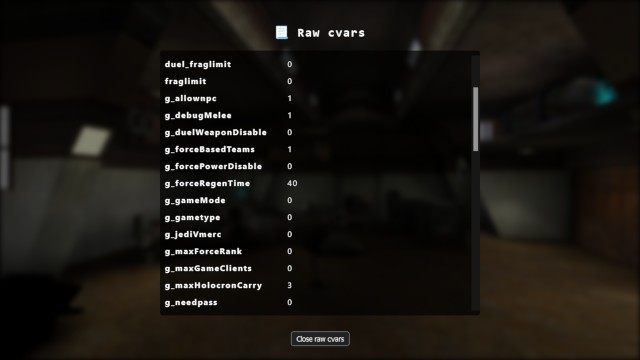

# JKA Server Status - PHP Script
This tool can send requests to a **Jedi Academy** server, to retrieve some basic server info,
as well as the player list.

[](doc/screenshot.jpg)

## Features
- Retrieves some basic server info, as well as the player list,
- Can also display all `cvars` received from the server,
- Caches responses for 10 seconds (server-side, configurable delay)
- Uses backgrounds from my [**Widescreen levelshots**](https://jkhub.org/files/file/4179-widescreen-levelshots/) pack
    - 1920x1080 resolution, available in JPG + AVIF formats,
    - User-configurable blur and opacity, to improve the readability,
    - Uses `default.jpg` when the map name doesn't match a known levelshot
    - You can add your own backgrounds in the `levelshots` folder, and they should be automatically detected
- Responsive layout
- Optional auto-refresh (user-configurable)

[](doc/settings.jpg)

[](doc/raw-cvars.jpg)

## Requirements
- A **web server** (Nginx, Apache, ...)
- **PHP 8.1** or newer

## Installation
1. Clone (or copy the content of) this repository onto your server,
2. Create a `config.php` file:
   1. Read: [**Basic `config.php` examples**](doc/basic-config-php-examples.md).
   2. For the full list of options, see: [`config.sample.php`](config.sample.php)
3. Make sure PHP has write access to the `var/cache` and `var/log` folders,
4. Setup your web server to point to the `public` folder,
5. Let the web server serve static files, and pass all other requests to `index.php`.

## Sample Nginx config
Have a look at [`nginx.sample.conf`](doc/nginx.sample.conf) for an example of:
- Conditional JPEG / AVIF serving
- HTML / CSS / JS compression
- Caching strategy
- Forwarding requests to PHP

Minimum required packages on Debian 12:
```sh
sudo apt install nginx-light
sudo apt install php-fpm
```

## PHPUnit
There are a few automated tests for PHP developers, in the `tests` directory.
```sh
wget -O phpunit.phar https://phar.phpunit.de/phpunit-12.phar
php phpunit.phar --bootstrap src/autoload.php tests
```
It's recommended to run them on your development machine, **not** on your production server.

## License
The code in this repository is released under the [MIT License](LICENSE.txt).

## Credits
- PHP / HTML / CSS / JS / Levelshots by [**Slash**](https://github.com/slash-fr)
- `default.jpg` is based on the following photo (CC0 Public Domain): https://pxhere.com/en/photo/57901  
  → Slightly tweaked by Slash
- Some icons are based on the [**ionicons pack**](https://ionic.io/ionicons) (MIT licensed).
